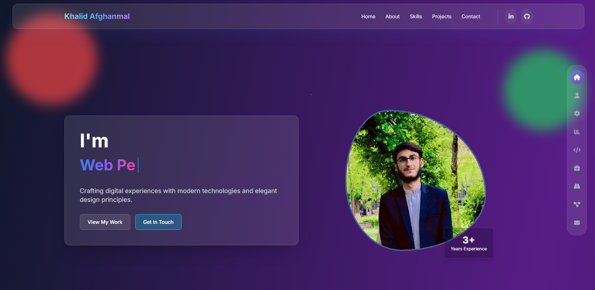
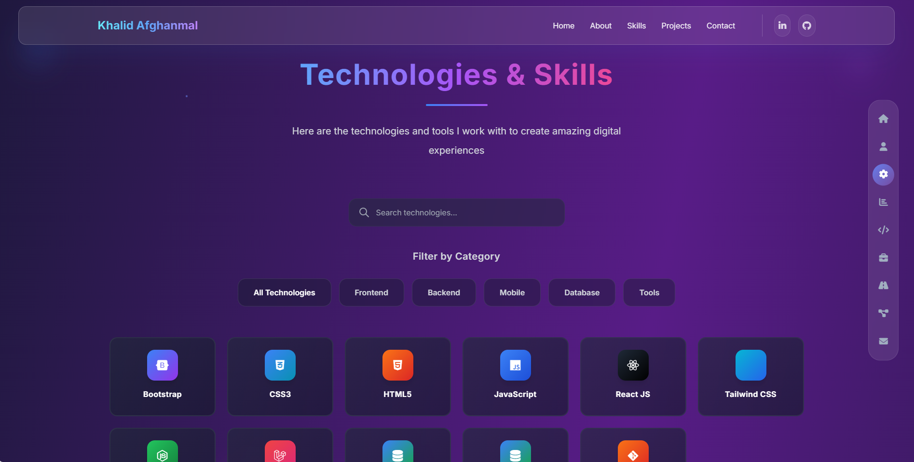

<h1 align="center">✨ Personal Portfolio Website ✨</h1>

<p align="center">
  
  
  
  
</p>

---

## 🧠 Overview
A **modern, responsive, and animated portfolio website** 

Built with **HTML, Tailwind CSS, JavaScript, and AOS**, this portfolio delivers a smooth, elegant browsing experience — optimized for both speed and style.

---

## 🖼️ Preview

<p align="center">
  
  <h5>2:</h5><br>
  
</p>

---

## ⚙️ Technologies Used
| Category | Stack |
|-----------|--------|
| **Frontend** | HTML5, Tailwind CSS, JavaScript |
| **Animations** | AOS (Animate On Scroll) |
| **Design** | Gradient backgrounds, Responsive layout, Custom transitions |
---

## ✨ Key Features
✅ Smooth scroll-based animations powered by **AOS**  
✅ **Responsive design** for mobile, tablet, and desktop  
✅ Modern **gradient skill bars** and animated sections  
✅ **Interactive UI** with subtle transitions  
✅ **Clean, minimalist, and professional layout**  
✅ SEO-friendly meta and semantic markup  

---

## 🚀 Getting Started
To run the project locally:

```bash
# Clone this repository
git clone https://github.com/khalidafghanmal/Portfolio
# Open the folder
cd portfolio

# Open in browser
open index.html
